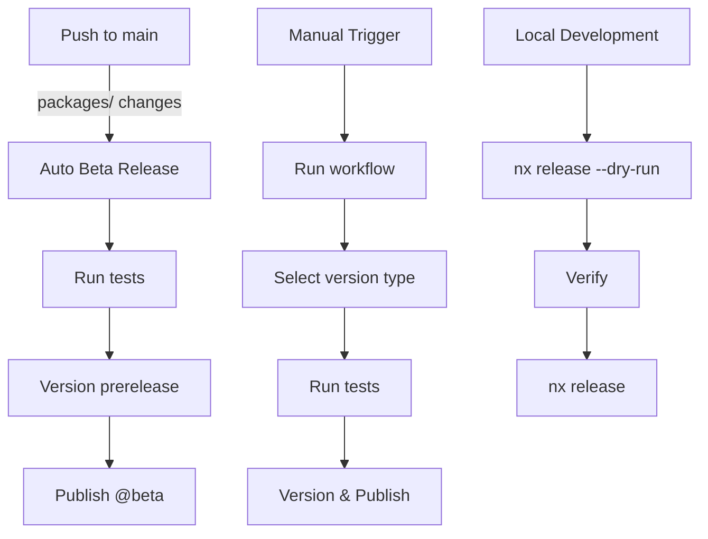

# Release Process

This document explains how to publish releases of `@ngx-signal-forms/toolkit`.

## Prerequisites

### GitHub Secrets

Add these secrets to your GitHub repository (Settings → Secrets and variables → Actions):

- `NPM_TOKEN`: NPM access token with publish permissions
  - Create at: https://www.npmjs.com/settings/[username]/tokens
  - Must be an "Automation" or "Publish" token

## Release Strategies

### 1. Automatic Beta Releases (Recommended for Development)

**Trigger:** Push to `main` branch with changes in `packages/`

**What happens:**

- Runs tests automatically
- Bumps version to next prerelease (e.g., `0.1.0` → `0.1.1-beta.0`)
- Publishes to npm with `beta` tag
- Creates git tag

**Install beta:**

```bash
npm install @ngx-signal-forms/toolkit@beta
```

**To disable:** Delete or comment out `.github/workflows/release-beta.yml`

### 2. Manual Releases from GitHub UI

**Trigger:** Actions → Release → Run workflow

**Options:**

#### Stable Release (latest)

- Version: `patch` / `minor` / `major`
- NPM Tag: `latest`
- Dry Run: `false`

#### Beta Release

- Version: `prerelease`
- Prerelease ID: `beta`
- NPM Tag: `beta`
- Dry Run: `false`

#### Next/Canary Release

- Version: `prerelease`
- Prerelease ID: `next`
- NPM Tag: `next`
- Dry Run: `false`

#### Custom Version

- Version: `custom`
- Custom Version: `1.2.3` or `2.0.0-rc.1`
- NPM Tag: (your choice)
- Dry Run: `false`

### 3. Local Release (Manual)

#### Prerequisites

```bash
# Install dependencies
pnpm install

# Ensure you're on main and up to date
git checkout main
git pull

# Login to npm
npm login
```

#### Stable Release

```bash
# Patch (0.1.0 → 0.1.1)
pnpm exec nx release version patch

# Minor (0.1.0 → 0.2.0)
pnpm exec nx release version minor

# Major (0.1.0 → 1.0.0)
pnpm exec nx release version major

# Then publish
pnpm exec nx release publish
```

#### Beta Release

```bash
# Create beta version (0.1.0 → 0.1.1-beta.0)
pnpm exec nx release version prerelease --preid=beta

# Publish to beta tag
pnpm exec nx release publish --tag=beta
```

#### Next/Canary Release

```bash
# Create next version (0.1.0 → 0.1.1-next.0)
pnpm exec nx release version prerelease --preid=next

# Publish to next tag
pnpm exec nx release publish --tag=next
```

#### Custom Version

```bash
# Set specific version
pnpm exec nx release version 2.0.0-rc.1

# Publish (choose appropriate tag)
pnpm exec nx release publish --tag=rc
```

### 4. Dry Run (Test Without Publishing)

Always test before releasing:

```bash
# From GitHub UI: Set "Dry Run" to true

# From command line:
pnpm exec nx release --dry-run

# Just version (no publish):
pnpm exec nx release version patch --dry-run

# Just publish (no version):
pnpm exec nx release publish --dry-run
```

## NPM Tags Explained

| Tag      | Purpose                | Install Command                              |
| -------- | ---------------------- | -------------------------------------------- |
| `latest` | Stable releases        | `npm install @ngx-signal-forms/toolkit`      |
| `beta`   | Pre-release testing    | `npm install @ngx-signal-forms/toolkit@beta` |
| `next`   | Bleeding edge / canary | `npm install @ngx-signal-forms/toolkit@next` |
| `rc`     | Release candidates     | `npm install @ngx-signal-forms/toolkit@rc`   |

## Version Bump Types

| Type         | Example              | When to Use                        |
| ------------ | -------------------- | ---------------------------------- |
| `patch`      | 0.1.0 → 0.1.1        | Bug fixes, minor changes           |
| `minor`      | 0.1.0 → 0.2.0        | New features (backward compatible) |
| `major`      | 0.1.0 → 1.0.0        | Breaking changes                   |
| `prerelease` | 0.1.0 → 0.1.1-beta.0 | Pre-release versions               |

## What Happens During Release?

1. **Pre-version checks:**
   - Runs `pnpm dlx nx run-many -t build` (configured in `nx.json`)
   - Ensures all projects build successfully

2. **Versioning:**
   - Updates `package.json` versions
   - Creates git commit with message: `chore(release): publish {version}`
   - Creates git tag: `v{version}`

3. **Changelog:**
   - Generates `CHANGELOG.md` (workspace level)
   - Generates project-level changelogs
   - Creates GitHub release

4. **Publishing:**
   - Publishes `dist/packages/toolkit` to npm
   - Uses specified npm tag (`latest`, `beta`, `next`, etc.)

## Troubleshooting

### "Not authenticated" error

```bash
npm login
# Or set NPM_TOKEN in GitHub secrets
```

### "Version already exists"

```bash
# Check existing versions
npm view @ngx-signal-forms/toolkit versions

# Use a different version or bump type
```

### Failed build during release

```bash
# Run locally first
pnpm exec nx run-many -t lint test build

# Fix errors, then try release again
```

### Revert a release

```bash
# Unpublish from npm (within 72 hours)
npm unpublish @ngx-signal-forms/toolkit@0.1.1

# Delete git tag
git tag -d v0.1.1
git push origin :refs/tags/v0.1.1

# Revert commit
git revert HEAD
```

## Best Practices

1. **Always run tests before releasing:**

   ```bash
   pnpm exec nx run-many -t lint test build
   ```

2. **Use dry run first:**

   ```bash
   pnpm exec nx release --dry-run
   ```

3. **Version progression:**
   - Development: `beta` → `rc` → `latest`
   - Keep `next` for experimental features

4. **Breaking changes:**
   - Always bump major version
   - Document in changelog
   - Provide migration guide

5. **Beta releases:**
   - Test thoroughly before promoting to `latest`
   - Let beta sit for at least a few days
   - Gather user feedback

## CI/CD Workflow Summary



## Support

For issues or questions:

- GitHub Issues: https://github.com/ngx-signal-forms/ngx-signal-forms/issues
- NPM Package: https://www.npmjs.com/package/@ngx-signal-forms/toolkit
